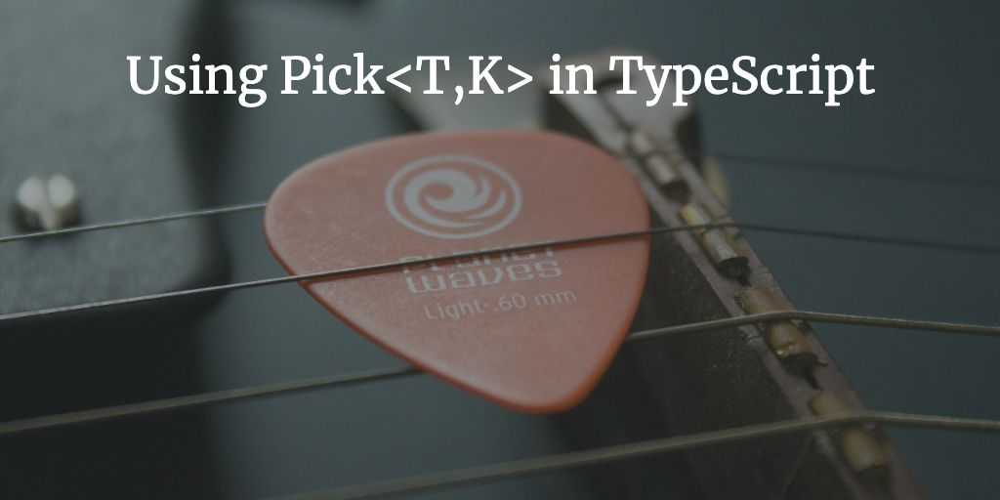

I used `Pick<T,K>` for the first time today in TypeScript. I had been using `Partial<T>` for a while to allow some properties of a class/interface to be used in other places in my application. After doing a lot more reading on TypeScript lately I decided to find a way to grab specific properties from a class/interface and lo and behold that’s what `Pick<T,K>` is for. I was going to do a write up on how I am using it but I [found a post that sums it up quite nicely](https://medium.com/codafication-blog/typescript-2-1-and-the-power-of-pick-ff433f1e6fb).
