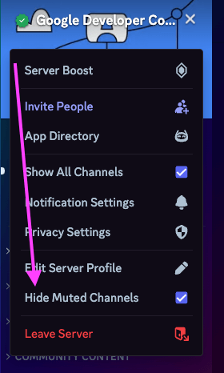
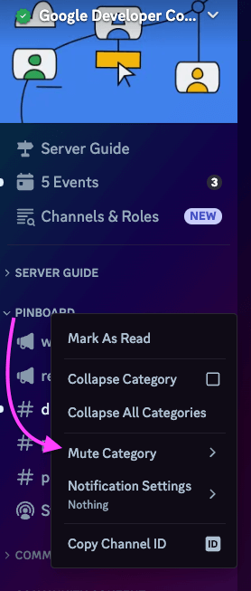
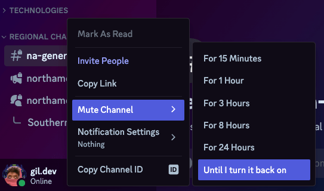

Discord can be overwhelming if you have never been in a server with a lot of channels and/or users before. One way to manage this is to mute channels that you are not interested in. 

First thing is first, you need to hide channels that your are muting. This makes it easier to focus on the channels that you are interested in. To do this you need to click on the sever name at the top of the menu and choose `Hide Muted Channels`.

Next is muting the channels and/or channel categories. This can be done by right-clicking on the channel or category and selecting `Mute #channel-name` or `Mute Category`. 

You can also mute a channel by clicking on the bell icon next to the channel name. This will prevent you from receiving notifications from that channel. You can always unmute the channel by following the same steps. 

Here is what this server looks like with most categories and channels muted.

