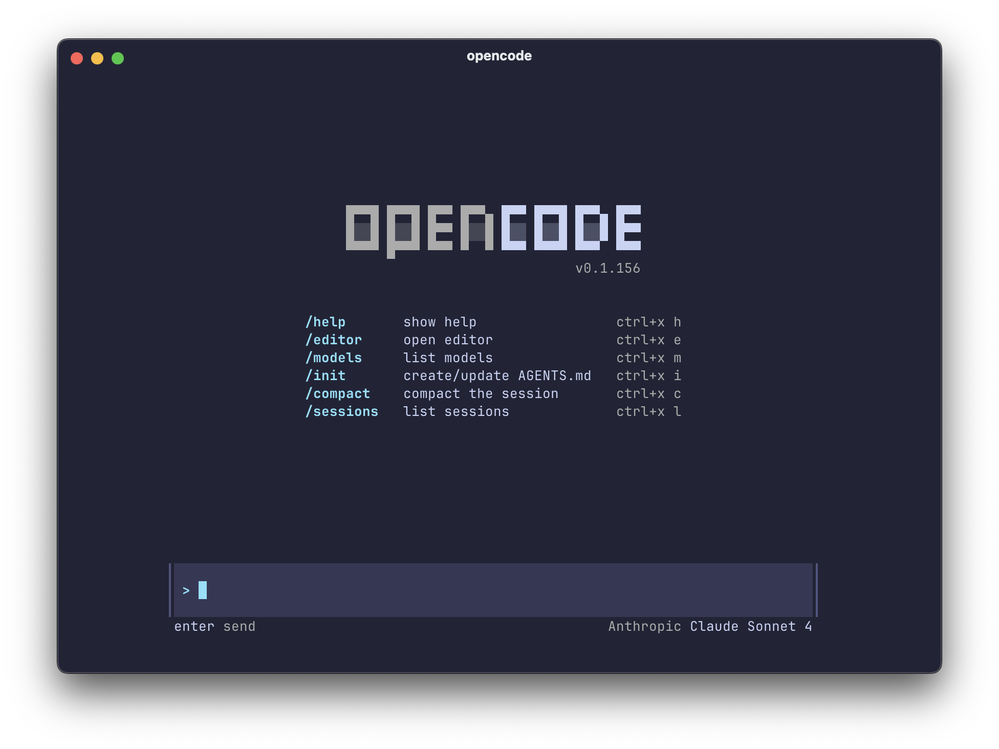

I found out about [OpenCode](https://opencode.ai/), a TUI for interacting with various LLM agents, a few weeks ago on Adam and Dax's podcast, [How About Tomorrow?](https://www.youtube.com/watch?v=XAOQeB0oA0E). I installed it but I hadn't gotten around to try it out until today, after talking about it last night at [a meetup](https://space-coast.dev/coffee-meetup). Luckily, Adam and Dax were on [The Standup](https://youtu.be/VsTbgYawoVc) today talking about OpenCode, the controversy with its previous iteration, and how agents work.

<iframe width="640" height="480" src="https://www.youtube.com/embed/VsTbgYawoVc" title="YouTube video player" frameborder="0" allow="accelerometer; autoplay; clipboard-write; encrypted-media; gyroscope; picture-in-picture; web-share" referrerpolicy="strict-origin-when-cross-origin" allowfullscreen></iframe>​