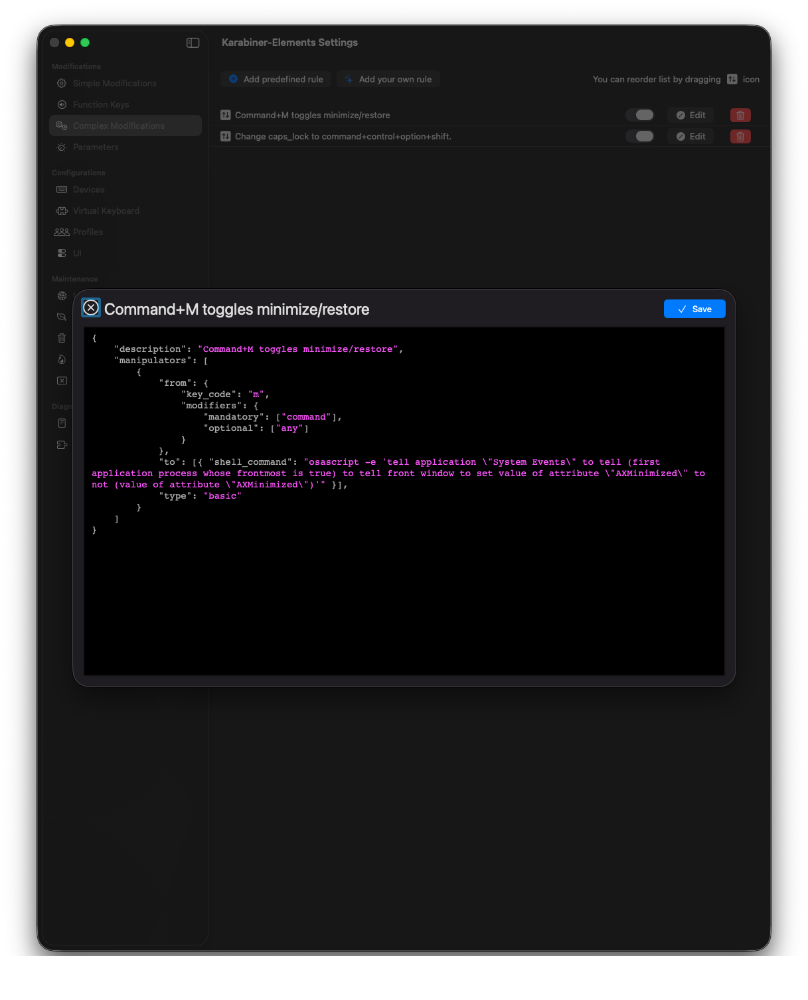

# How to modify Command + M to restore windows
I recently [removed my Dock from Mac OS X](/is-there-a-way-to-completely-disable-dock) and restoring windows became a bit of a hassle. With this script in Karabiner Elements, you can make `Command + M` work as a toggle. You will also need to allow Karabiner access in the settings for accessibility. It will ask you when you first try the shortcut after adding it.

```json
{
  "description": "Command+M toggles minimize/restore",
  "manipulators": [
    {
      "type": "basic",
      "from": {
        "key_code": "m",
        "modifiers": {
          "mandatory": ["command"],
          "optional": ["any"]
        }
      },
      "to": [
        {
          "shell_command": "osascript -e 'tell application \"System Events\" to tell (first application process whose frontmost is true) to tell front window to set value of attribute \"AXMinimized\" to not (value of attribute \"AXMinimized\")'"
        }
      ]
    }
  ]
}
```

